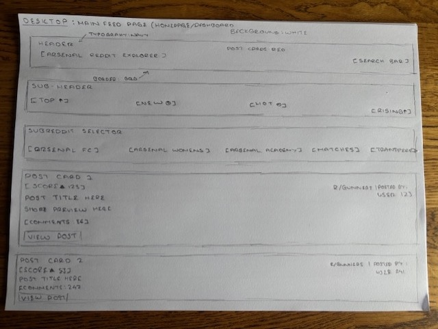
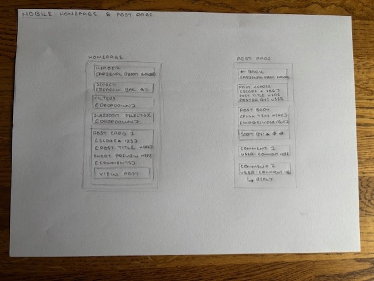
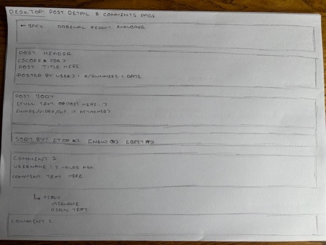
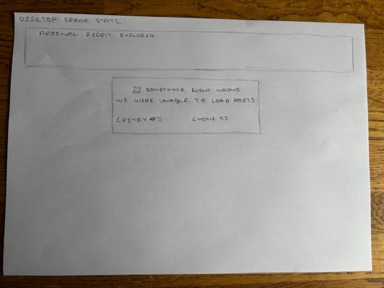
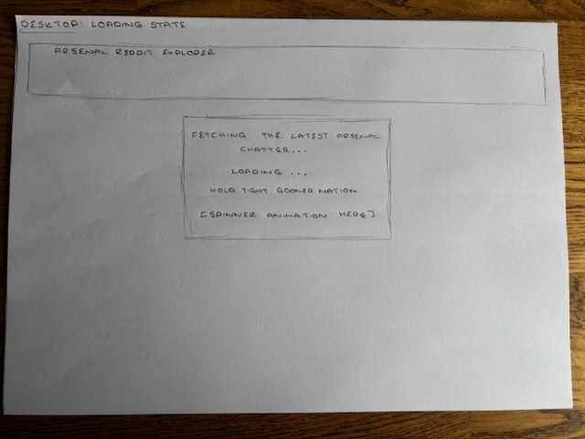

# Arsenal Reddit Comment Explorer - Wireframes & UX Plan

## 1. Purpose of the Wireframes
These wireframes will help me to define the structure, flow, and key user interactions of the **Arsenal Reddit Comment Explorer** application. They exist to guide development, ensure clarity of vision, and provide a visual reference as the project evolves. 

---

## 2. Screens & Views

### Homepage/Main Feed
**Purpose:** Display Arsenal Reddit content in a clean, accessible way. 

**Key elements planned:**
- Header with title/branding
- Subreddit selector
- Filters (latest, most upvoted, most commented)
- Lists of posts
- Basic metadata per post (author, time, score)
- Clear CTA to view comments

**Wireframe:**: 

### Post Comments View
**Purpose:** Allows users to explore meaningful discussions. 

**Key elements planned:**
- Post title and context
- Back to feed navigation
- Comment thread display
- Nested replies structure
- Loading and error states

**Wireframe:**

### Error & Empty States
It's important that the app is able to handle everything gracefully and provide a clean UX. 

**Planned scenarios:**
- No internet/API available
- No posts returned
- No comments returned
- Rate limit issues

**Wireframe:**

---

## 3. Design Considerations

### Colour Palette & Branding
- Inspired by **Arsenal FC**
  - Red and white emphasis
  - Clean sport-style UI
- A subtle nod to personal preferences and the **MadeByMeade** signature
  - Strong typography choices
  - Thoughtful spacing and layout
  - Professional portfolio look and feel

---

## 4. Components
I'm aiming to break down sections and features of the app into **React components**, including:
- `<Header />`
- `<SubredditSelector />`
- `<FilterControls />`
- `<PostsList />`
- `<PostCard />`
- `<CommentList />`
- `<Comment />`
- `<ErrorMessage />`
- `<LoadingSpinner />`

Wireframes will help define these components prior to coding. 

---

## 5. Responsive Design Notes
The app will work well across all devices. 

### Desktop
- Multi-column spacing
- Comfortable reading width

### Tablet
- Slightly reduced spacing
- Controls remain accessible

### Mobile
- Single column layout
- Simple scrolling experience
- Touch-friendly buttons

---

